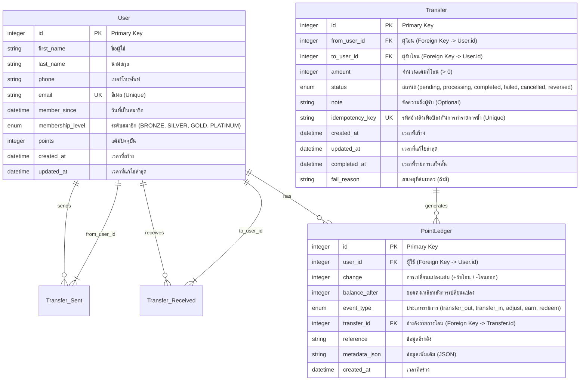

# Database Structure - ER Diagram

แผนผังความสัมพันธ์ของฐานข้อมูล LBK Points API

## คำอธิบาย

### ตาราง User (ผู้ใช้)
- เก็บข้อมูลผู้ใช้และแต้มปัจจุบัน
- มีระดับสมาชิก (BRONZE, SILVER, GOLD, PLATINUM)
- อีเมลเป็น unique key

### ตาราง Transfer (รายการโอนแต้ม)
- เก็บประวัติการโอนแต้มระหว่างผู้ใช้
- มี idempotency_key เป็น unique key สำหรับค้นหารายการและป้องกันการทำรายการซ้ำ
- บันทึกสถานะการโอนแต้ม (pending, processing, completed, failed, cancelled, reversed)

### ตาราง PointLedger (สมุดบัญชีแต้ม)
- เก็บประวัติการเปลี่ยนแปลงแต้มทั้งหมดแบบ append-only
- รองรับหลายประเภทรายการ (transfer_out, transfer_in, adjust, earn, redeem)
- บันทึกยอดคงเหลือหลังการเปลี่ยนแปลงทุกครั้ง

## ความสัมพันธ์
- ผู้ใช้หนึ่งคนสามารถโอนแต้มได้หลายรายการ (1:N)
- ผู้ใช้หนึ่งคนสามารถรับโอนแต้มได้หลายรายการ (1:N)
- การโอนแต้มหนึ่งรายการสร้าง point ledger entries 2 รายการ (1:2) - ฝั่งผู้โอนและฝั่งผู้รับ
- ผู้ใช้หนึ่งคนมีประวัติรายการแต้ม (point ledger) หลายรายการ (1:N)